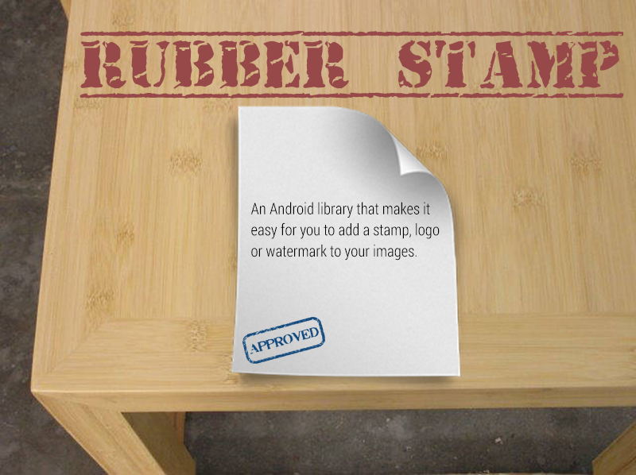

RubberStamp:mailbox:
================



RubberStamp is an Android library that makes it easy for you to add a stamp, logo or watermark to your images.

Screenshots
------------


Features
---------

* Add text or logos (drawables) on top of your images.
* Customize the font, color, size, position, etc.
* Choose from 8 different pre defined positions for your logo/stamp.


Setup
------
The library is pushed to Maven Central as an AAR, so you just need to add the following to your build.gradle file:
```java
dependencies {
    compile ‘com.vinaygaba:rubberstamp:1.0.0’
}
```

Usage
------
Using RubberStamp is extremely easy.
